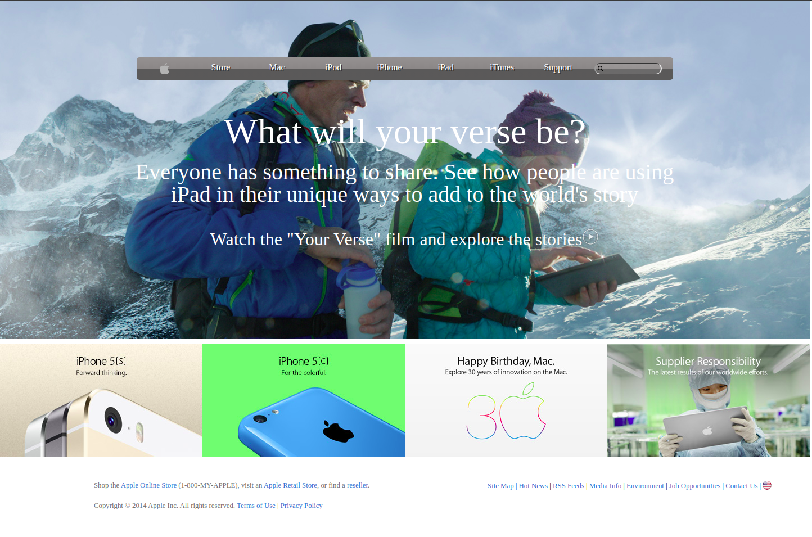

# Apple website clone

> This webpage is the clone of the old apple website

This website uses linear gradient in menu and flex for layouts of menu.

## Built With

- HTML5
- CSS3

## Live Demo

[Live Demo Link](https://raw.githack.com/harshdeepkanhai/apple-website-clone/master/index.html)

## Authors

👤 **Harshdeep Kanhau**

- Github: [@harshdeepkanhai](https://github.com/harshdeepkanhai)
- Twitter: [@harshdeepkanhai](https://twitter.com/harshdeepkanhai)
- Linkedin: [harshdeepkanhai](https://linkedin.com/in/harshdeepkanhai)

## 🤝 Contributing

Contributions, issues and feature requests are welcome!

Feel free to check the [issues page](issues/).

## Show your support

Give a ⭐️ if you like this project!

## Acknowledgments

- the Odin Project
- [apple old website](https://web.archive.org/web/20140301004610/http://www.apple.com/)

## 📝 License

This project is [MIT](lic.url) licensed.
